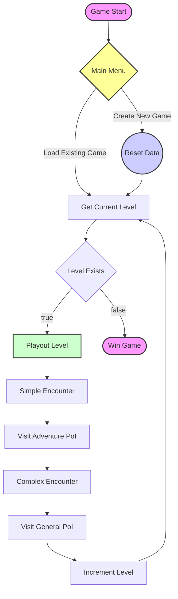

questions have weight
the higher the weight, the better the upgrade
upgrade is chosen randomly
upgrade can either be an item, or a stat boost
interactions have 2 stages, the question and the fight
if you have enough items/good enough stats to win the fight you progress
if you have answered too many questions wrong, you will not be strong enough to win the fight, and will need to restart

---

# The Parade
This is a silly little game made for my comp sci course.

I would have liked to add a proper story line but decided to design the project to be extensible
for the sake of showing an example of my knowledge of OOP and design patterns.

You can easily add new levels (and stages), creatures and items to the game!
While the character system isn't designed to add more, you could if you wanted to.

---

# How to Play
1. `pip install`
2. `py main.py`

---

# Product Requirements (PRD)

## 1. Overview

**Product Name**: The Parade

**Description**:
The Parade! Choose your adventurer, 
go around the world slaying progressively harder creatures and level up your character!

**Target Audience**:
- All Ages
- People bored while in school or a meeting
- RPG/Adventure Game Enjoy-ers

---

## 2. Product Problem Statement
- **Hardware Requirements**: Many games have heavy hardware requirements, which many people cannot meet.
- **Must be educational**: 
- **Skill Gap & Ceiling**: Games need to have a good balance between easy and challenging, and they need room for the player to practice and get better.

---

## 3. Functional Requirements
| Requirement          | Plan to achieve the goal                                                                               |
|----------------------|--------------------------------------------------------------------------------------------------------|
| Easy to play & learn | To make the game easy to learn there is a tutorial level which covers core components of the game  |
| Everyone can play    | People of all ages and backgrounds should be able to easily play the game.                             |
| Progression System   | Players level up and unlock new abilities and gear by defeating progressively harder enemies.          |

---

## 4. Non-Functional Requirements
| Requirement                  | Plan to Achieve the Goal                                                                  |
|------------------------------|-------------------------------------------------------------------------------------------|
| Cross-Platform Compatibility | Ensure the game runs smoothly on any OS (Windows, macOS, Linux).                          |
| Low System Requirements      | Use lightweight assets and optimized code to support older or low-end hardware.           |
| Fast Load Times              | Minimize asset sizes and external dependencies to reduce loading time on all connections. |

---

## 5. Data Types
1. I use `integer` to hold player stats. I use integers as I do not need floating point precision.
2. I use `string` as identifiers. When identifying data its important that each ID is unique, which is why UUID's exist. I do not need that amount of uniqueness in a small single player game, so I have opted for strings.
3. I use `boolean` to mark a question type as requiring an answer to be defined in the code for defining a question. This is used to verify code before it is an issue.

---

## 6. Data Structures
1. I use `dict` aka `hash table` as the underlying data structure for my Repository data stores. Repositories need to hold key value pairs. Which is exactly what a dictionary does.
2. I use `tuple` (a typed `array` with predefined length) to return 2 values from 1 method without needing a whole new object. It is a lightweight way to pass data around.

---

## 7. Data Dictionary
| Variable     | Data Type | Format for display | Size in bytes | Size for display | Description                                                                                                                                | Example | Validation                      |
|--------------|-----------|--------------------|---------------|------------------|--------------------------------------------------------------------------------------------------------------------------------------------|---------|---------------------------------|
| identifier   | string    | XX..XX             | 5             | 5                | A primary key for each player saved in a database, there is only 1 player save per character, so the identifier is the character selected. | Roxy    | Must match a character          |
| intelligence | integer   | NN..NN             | 4             | 1-3              | How intelligent the player is, used to help decide what questions they should be shown                                                     | 9       | Must be greater than 0          |
| strength     | integer   | NN..NN             | 4             | 1-3              | How strong the player is, upgraded in gameplay to beat monsters                                                                            | 20      | Must be greater than 0          |
| agility      | integer   | NN..NN             | 4             | 1-3              | How agile the player is, upgraded in gameplay to beat monsters                                                                             | 4       | Must be greater than 0          |
| health       | float     | NN.NN              | 8             | 5                | How much health the player has.                                                                                                            | 12.50   | Must be between 20.00 and 00.00 |

---

# Game Flow Chart
